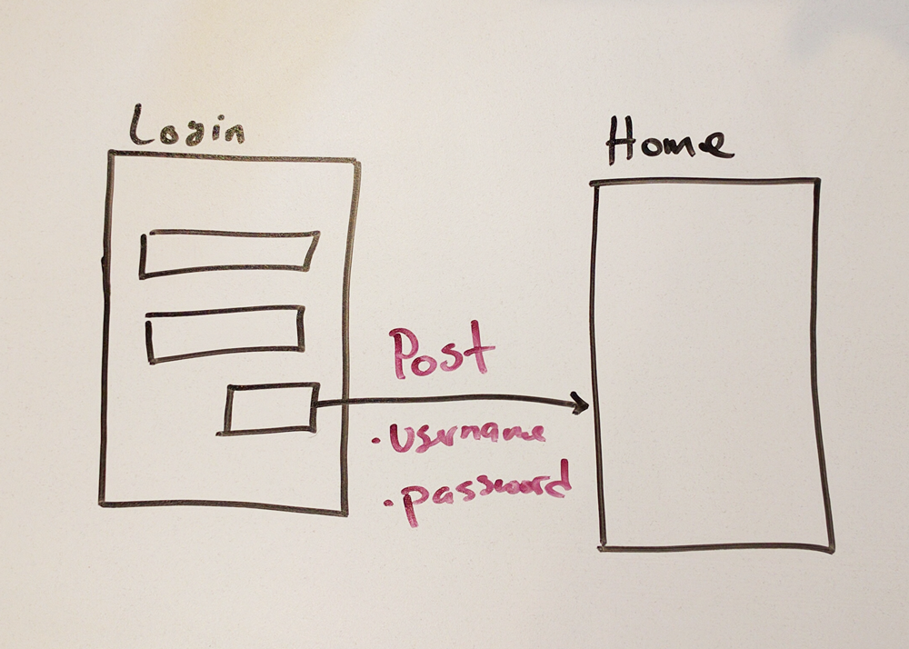

# HTTP-lab

This is the lab. :)
mjgfuwyte

* Social Network
* Clothing Store
* YouTube
* GitHub
* Instagram
* Spotify

--
* **Bonus**: An Email app

title | type | duration | creator
----- | ---- | -------- | -------
Practicing HTTP and REST Concepts | lab | 1:30 | James Davis (New York)

--

#  Practicing HTTP and REST Concepts

_This is a group exercise. Divide into groups of 3 or 4._

You just learned about HTTP and REST. For this lab, I would like you define the types of requests and the data that is being sent, if any.

Choose from one of the following apps:

* A custom Social Network
* A custom Clothing Store
* YouTube
* GitHub
* Instagram
* Spotify

On the white board, draw out the screens of **one** of the apps above. Draw arrows between each screen, and write the type of request made. Example: When clicking the login screen, a POST request is made, sending the username and password to the server.

#### Requirements

* Draw a multi-screen prototype of one of the 6 apps
* Draw arrows between each screen, defining the type of request made (if any).
* List all of the requests made, including request type and data sent, in the [answers](answers.md) markdown file.

**Bonus:** Create a second prototype, with all of the requests, for an email app (like Gmail). 

#### Deliverables

* Picture of your app schema, in the [images](images) folder.
* List of requests made in the [answers](answers.md) file.

